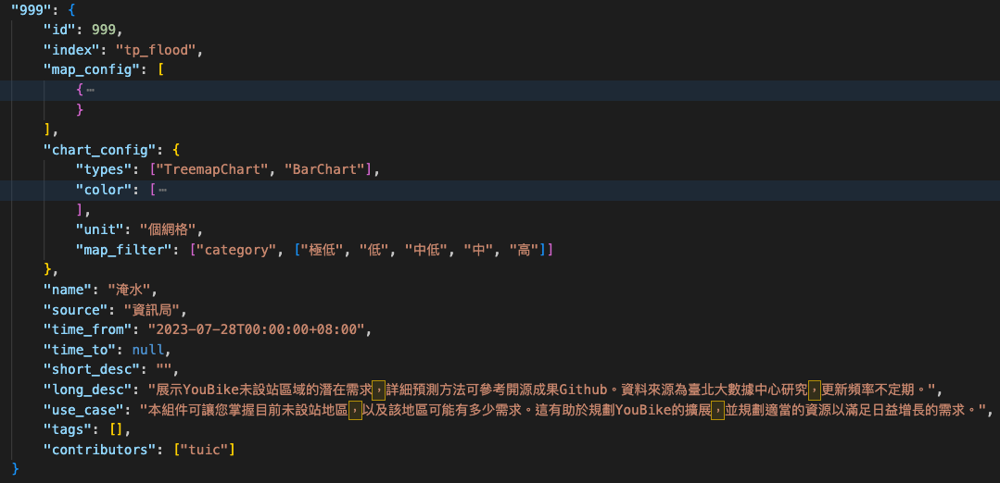

Step by step guid to add a new compoent

1. get raw data from any source and convert it to xyz.geojson

an online converter example: \
https://mygeodata.cloud/converter/kml-to-geojson

2. add xyz.geojson to ./mapData

3. add a conponent to all_components.json
   

    - index should be mapped to .geojson, in this case: xyz
    - id should be mapped to .json under chartData in this case: 999

TODO: detail configuration about map_config and chart_config
